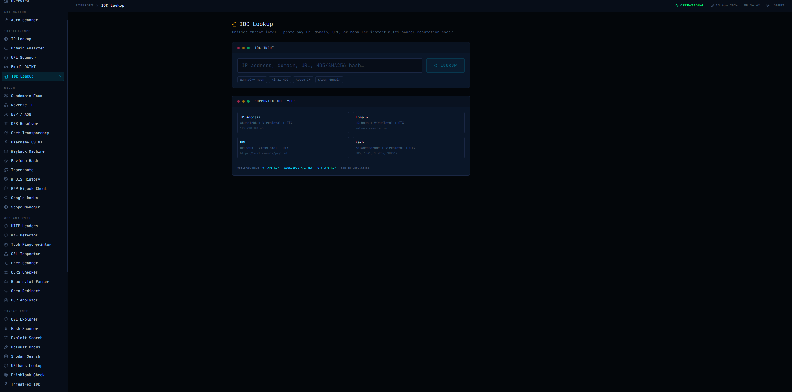

# CyberOps Dashboard

> A full-stack cybersecurity operations platform — 50+ integrated tools across OSINT, recon, threat intelligence, web analysis, forensics, automation, asset monitoring, and reporting. Built with Next.js 15, TypeScript strict mode, and Tailwind CSS. Zero third-party UI or HTTP libraries. Deployed on Vercel.



**Backend API:** [threat-intel-platform](https://github.com/boclaes102-eng/threat-intel-platform) &nbsp;·&nbsp; **Desktop App:** [CyberSuite Pro](https://github.com/boclaes102-eng/Cybersecurity-software)

---

## What Makes This Special

This is not a collection of API wrappers bolted onto a UI. Every non-trivial algorithm is implemented from scratch — no chart libraries, no HTTP clients, no utility belts. TypeScript strict mode is enforced with zero `any` escapes throughout. Every backend API key stays server-side and never reaches the browser bundle.

Most importantly, this dashboard is one node in a **three-platform ecosystem**: recon results saved here flow into a shared PostgreSQL backend and can be loaded directly into the CyberSuite Pro desktop attack tool — creating a complete recon-to-exploitation pipeline across web, backend, and desktop.

---

## Three-Platform Ecosystem

```
┌──────────────────────────────────────────────────────────────────────┐
│                   CyberOps Dashboard  (this repo)                    │
│                   Next.js 15 · Vercel · TypeScript strict            │
│                                                                       │
│   50+ recon / intel / analysis / web tools                            │
│   ↓  "Save to Workspace" button on every tool result                 │
│   ↓  POST /api/monitor/recon-sessions  (server-side proxy)           │
└───────────────────────────┬──────────────────────────────────────────┘
                            │ HTTPS · X-API-Key header (never in browser)
                            ▼
┌──────────────────────────────────────────────────────────────────────┐
│             Threat Intel Platform  (separate repo)                   │
│             Fastify · PostgreSQL 16 · BullMQ · Redis · Railway       │
│                                                                       │
│   recon_sessions  ←  stores tool + target + full results JSON        │
│   assets / alerts / vulnerabilities / ioc_records                    │
│   Background workers: CVE feed sync · IOC scan · asset correlation   │
└───────────────────────────┬──────────────────────────────────────────┘
                            │ X-API-Key
                            ▼
┌──────────────────────────────────────────────────────────────────────┐
│             CyberSuite Pro Desktop App  (separate repo)              │
│             Python · CustomTkinter · Windows                         │
│                                                                       │
│   Recon page fetches saved sessions → one click sets active target   │
│   Target copied to clipboard → paste into WAT / PGN / CEH tools     │
│   Offline fallback: manual target entry when no internet             │
└──────────────────────────────────────────────────────────────────────┘
```

The dashboard never exposes the backend API key to the browser. The Next.js catch-all proxy route (`/api/monitor/[...path]`) injects `X-API-Key` from a server-side environment variable before forwarding the request to Railway — zero CORS surface, zero credential exposure.

---

## Technically Notable Implementations

### From-scratch algorithms — no npm dependencies

| Feature | What was built |
|---|---|
| **Sliding-window rate limiter** | `Map<string, number[]>` of timestamps. 60 req/min default, 20 req/min for paid API routes. Runs at the Vercel Edge before any route handler is invoked — rate-limited requests never consume a serverless function. |
| **Wagner-Fischer edit distance** | O(n) rolling `Uint16Array` — used for SSDEEP fuzzy hash segment similarity. Not a library call. |
| **SSDEEP blocksize compatibility** | Full `equal / double / half` blocksize comparison per the spamsum spec, including the 7/2 block size reduction loop. |
| **MurmurHash3** | Favicon hash fingerprinting for Shodan pivoting — produces the same signed 32-bit integer Shodan indexes. |
| **CVSS v3.1 base score** | Full scoring formula (AV, AC, PR, UI, S, C, I, A) with vector string round-trip — no external scoring library. |
| **DataView multi-interpretation** | Hex/binary tool interprets any byte sequence as int8 through int64, float32/64, both big and little endian — 16 interpretations per input via the Web `DataView` API. |
| **BigInt decimal representation** | Large byte arrays converted to accurate decimal without floating-point loss — needed for interpreting uint64 values correctly. |

### Architecture decisions

**No authentication.** This is a private operator tool — Clerk was removed entirely. The Next.js middleware runs only for `/api/*` routes and does nothing but rate-limit. The full layout renders unconditionally. No login page, no session, no redirect logic.

**Server-side proxy for all backend calls.** Every request to the Threat Intel Platform goes through a single Next.js catch-all route. The client never sees the API key, the upstream URL, or the raw response. CORS is structurally impossible — the browser only ever talks to the same Next.js origin.

**TypeScript discriminated unions.** Every API response shape is a named discriminated union type. The compiler enforces exhaustive handling at every call site. No `response.data?.thing?.value` optional chaining chains.

**Edge middleware.** Rate limiting runs at Vercel's Edge network layer. The Node.js runtime is never invoked for rejected requests — this matters for keeping cold-start latency low on high-traffic bursts.

**Zero layout thrash.** Sidebar scrolls independently from the main content area. Each tool page is fully self-contained — no shared state, no context providers, no global stores. Tools that make multiple parallel requests use `Promise.all` directly.

---

## Feature Overview

### OSINT & Intelligence
| Tool | What it does |
|---|---|
| IP Lookup | AbuseIPDB + ip-api.com enrichment, confidence score, geolocation, ISP, abuse history |
| Domain Analyzer | WHOIS, DNS records (A/AAAA/MX/TXT/NS/CAA), reputation check |
| URL Scanner | VirusTotal multi-engine scan, redirect chain tracing, screenshot metadata |
| Email OSINT | Breach database lookup, mail server health, MX/SPF/DKIM/DMARC validation |
| IOC Lookup | Unified IP / domain / URL / hash lookup across AbuseIPDB, VirusTotal, AlienVault OTX |

### Recon
| Tool | What it does |
|---|---|
| Subdomain Enumeration | Passive enumeration via crt.sh certificate transparency logs |
| Reverse IP | All domains on a shared IP via HackerTarget |
| BGP / ASN | Prefix, peer, and routing table data for any ASN |
| DNS Resolver | Live multi-record DNS resolution |
| Cert Transparency | Real-time CT log search via crt.sh |
| Username OSINT | Parallel availability check across 20+ platforms |
| Wayback Machine | Archive history and snapshot availability |
| Favicon Hash | MurmurHash3 fingerprinting for Shodan pivoting |
| Traceroute | MTR-style hop enumeration with per-hop IP enrichment |
| WHOIS History | Historical registration data |
| BGP Hijack Check | Route origin validation |
| Google Dorks | Pre-built dork templates for common recon patterns |
| Scope Manager | Per-engagement target list with in/out-of-scope tagging |

### Web Analysis
| Tool | What it does |
|---|---|
| HTTP Headers | Security header audit with pass/warn/fail grading |
| WAF Detector | Fingerprints WAF vendors from response headers and error pages |
| Tech Fingerprinter | Stack detection via response headers, HTML meta, and script patterns |
| SSL Inspector | Certificate chain, cipher suite, expiry, and protocol audit |
| Port Scanner | Shodan-backed or live TCP connect scan |
| CORS Checker | Tests CORS policy with spoofed Origin headers |
| Robots.txt Parser | Fetches + parses robots.txt, follows Sitemap references |
| Open Redirect | Parallel parameter fuzzing for open redirect vulnerabilities |
| CSP Analyzer | Content-Security-Policy parser with directive-level risk grading |

### Threat Intelligence
| Tool | What it does |
|---|---|
| CVE Explorer | NIST NVD search with CVSS score display and CWE mapping |
| Hash Scanner | VirusTotal multi-engine hash lookup |
| Exploit Search | ExploitDB search by CVE or keyword |
| Default Credentials | CIRT.net default credential database lookup |
| Shodan Search | Full Shodan search with facets and host data |
| URLhaus Lookup | abuse.ch URLhaus malware URL and payload database |
| PhishTank Check | PhishTank phishing URL verification |
| ThreatFox IOC | abuse.ch ThreatFox IOC and malware family lookup |
| Ransomware Tracker | ransomware.live group and victim tracking |

### Analysis & Forensics
| Tool | What it does |
|---|---|
| Password Audit | Entropy scoring, character class analysis, breach check via HIBP k-anonymity |
| Hash Tools | MD5/SHA1/SHA256/SHA512 generation from text input |
| Fuzzy Hash (SSDEEP) | Context-triggered piecewise hash comparison with similarity scoring via Wagner-Fischer |
| JWT Analyzer | Header/payload decode, algorithm audit, expiry check |
| CVSS Calculator | CVSS v3.1 base score calculator with vector string output |

### Utilities
| Tool | What it does |
|---|---|
| Payload Generator | XSS, SQLi, SSTI, SSRF, XXE, path traversal, command injection payload sets |
| Encoder / Decoder | Base64, URL, HTML entity, hex, Unicode, JWT decode |
| Token Generator | Cryptographically random API keys, UUIDs, passwords, nonces |
| Hex / Binary | Multi-format converter with full DataView integer interpretation (int8–int64, float32/64, BE/LE) |
| Regex Tester | Live regex engine with 35+ security presets across 6 categories |

### Automation
| Tool | What it does |
|---|---|
| Automation Scanner | Chain recon and analysis steps into sequential workflows. Built-in presets for Domain, IP, and Webapp targets. Custom workflow builder with step ordering, parallel execution, per-step timing, and auto-generated finding summaries. Saves to localStorage. |

### Recon Workspace
| Page | What it does |
|---|---|
| Recon Sessions | Browse, filter, and delete all recon sessions saved from tool results. Expandable rows with full JSON. Shared with the CyberSuite desktop app via the backend database — the bridge between web recon and desktop attack tooling. |

### Asset Monitor
Requests proxied server-side via `/api/monitor/[...path]` — no CORS, no key exposure.

| Page | What it does |
|---|---|
| Assets | Register IPs, domains, CIDRs, and URLs for continuous background monitoring |
| Alerts | Real-time security alerts from background scans — filter by severity, mark as read |
| Vulnerabilities | CVEs matched to your assets by the backend's NVD feed sync — with remediation tracking |

### SIEM
Real-time security event monitoring sourced from connected infrastructure (currently: `thedeepspaceproject.be`).

| Page | What it does |
|---|---|
| Event Timeline | Live feed of all security events across every source — filters by time range (1h / 6h / 24h / 7d), category, and severity. Auto-refreshes every 30s. |
| Incidents | Auto-detected incidents raised by the correlation engine — status workflow (open → investigating → resolved), severity filtering. |

**Correlation rules active:**

| Rule | Trigger | Severity |
|---|---|---|
| Brute Force | 5+ failed logins in 10 min | HIGH |
| XSS Attempt | Any `xss_attempt` event | HIGH |
| SQL Injection | Any `sqli_attempt` event | HIGH |
| Prototype Pollution | Any `prototype_pollution` event | HIGH |
| IOC Spike | 3+ IOC matches in 10 min | HIGH |
| Port Scan | 10+ unique destination ports from same IP in 5 min | MEDIUM |
| Credential Stuffing | 10+ failed logins across 3+ target IPs in 5 min | CRITICAL |

### Reporting
| Tool | What it does |
|---|---|
| Report Builder | Structured pentest report — Finding, IOC, Text, Raw section types. Exports to PDF and Markdown. Auto-saves draft to localStorage. |
| Investigation Notes | Per-target timestamped timeline. Types: Finding, IOC, Observation, Action. Severity tagging, full-text search, Markdown export. |

---

## Stack

| Layer | Technology |
|---|---|
| Framework | Next.js 15 (App Router, Edge middleware) |
| Language | TypeScript 5 (strict, zero `any`) |
| Styling | Tailwind CSS 3.4 + custom cyber design tokens |
| Icons | lucide-react |
| Rate Limiting | In-memory sliding window — built from scratch |
| Client storage | localStorage |
| Backend storage | PostgreSQL 16 via server-side proxy |
| Deployment | Vercel (auto-deploy on push to `main`) |

---

## Local Setup

```bash
git clone https://github.com/boclaes102-eng/Online-Cyber-dashboard
cd Online-Cyber-dashboard
npm install

cp .env.local.example .env.local
# Fill in API keys — all tools degrade gracefully without them

npm run dev   # → http://localhost:3000
```

### Environment Variables

| Key | Required | Description |
|---|---|---|
| `THREAT_INTEL_API_URL` | For Asset Monitor + Workspace | Railway backend URL |
| `THREAT_INTEL_API_KEY` | For Asset Monitor + Workspace | Long-lived API key from backend |
| `ABUSEIPDB_API_KEY` | Optional | 1,000 checks/day free |
| `VT_API_KEY` | Optional | 4 req/min free |
| `NVD_API_KEY` | Optional | Higher NVD rate limit |
| `SHODAN_API_KEY` | Optional | Port scanner + Shodan search |
| `OTX_API_KEY` | Optional | AlienVault OTX enrichment |
| `PHISHTANK_API_KEY` | Optional | PhishTank verification |

---

## Deployment

1. Push to GitHub
2. Import repo at vercel.com
3. Add environment variables under **Settings → Environment Variables**
4. Deploy — automatic on every push to `main`
